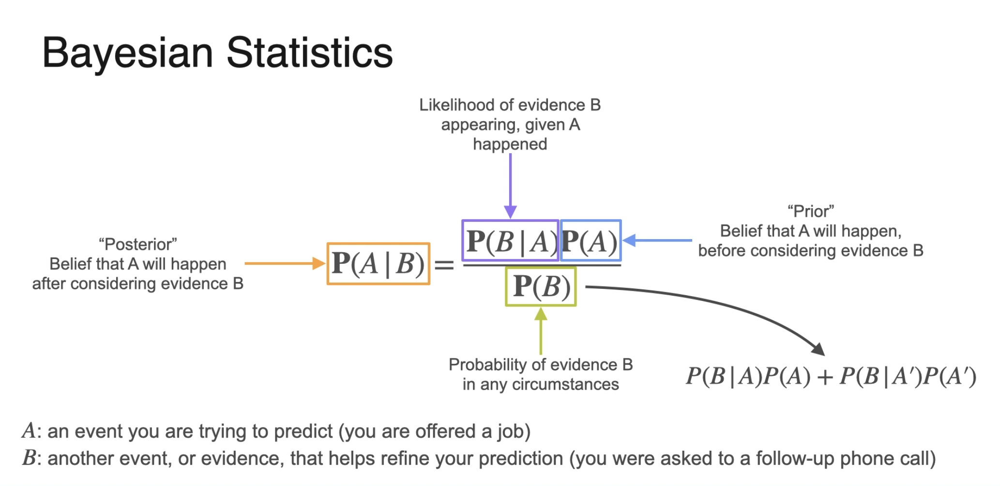

# Probability

## Addition rule
P(A or B)=P(A)+P(B)

if A and B are mutually exclusive.

## Multiplication rule

P(A and B)=P(A)×P(B)

if the events and independent

## Conditional probability

P(A|B) = P(A and B) / P(B)

## The Binomial Formula

 X ~ B(n, p)

When you repeat an experiment 𝑛 times (like coin flips), and each trial has:

 - probability of success = p
- probability of failure = 1−p

The probability of getting exactly k successes is:

𝑃(exactly 𝑘 successes ) = ( n k) * [ p ^(k) ] * [(1-p) ^(n-k)] 

(n k) = n! / [k! (n-k)!]

- Mean: u = n*p
- Variance o^2 = n x p (1-p)

## Geometric Distribution
The geometric distribution is related to the binomial distribution. 
Instead of counting the number of successes in a fixed number of trials, it counts the number of trials needed to achieve the first success.

## Negative Binomial Distribution
The negative binomial distribution is a more general case of the geometric distribution. 
While the geometric distribution counts the number of trials needed to achieve the first success, the negative binomial distribution counts the number of trials needed to achieve a specified number of successes (r).

## Bayesian
