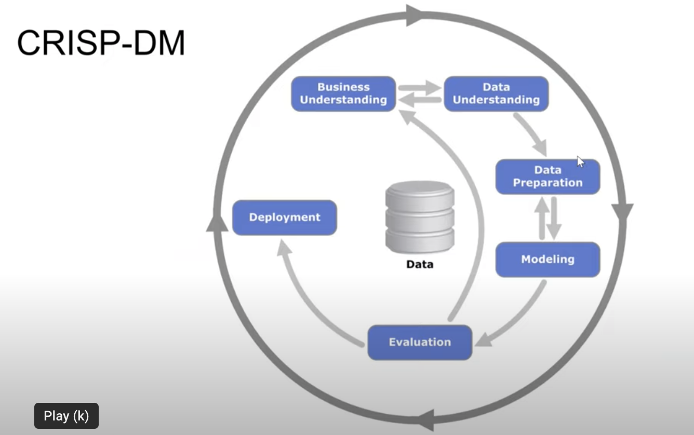

# Introduction

## CRISP-DM
*Cross Industry Standard Process for Data Mining*, set by IBM in the 90s, still used nowadays.

**STEPS:**
1. **Business Understanding**: Which problem are you trying to solve and how are you going to measure success? (*Will machine learning solve the problem*?) 
- *Define the goal(s); The goal will be measurable by*

2. **Data Understanding**: Analyse available data sources (*Do we need more data? How to get to the data? How good is the data?*)

3. **Data Preparation**: Transform the data so it can be put into a ML algorithm.
(*Clean the data, build pipelines, convert into tabular form*)

4. **Modeling**: Train the model. ML happens at this step. (Add new features, fix data issues, iteration with previous step)

5. **Evaluation (+ Deployment)** Select the best possible model and see how model performs. 

6. **Deployment** Roll the model to all users, monitoring, ensure quality and maintainability.

