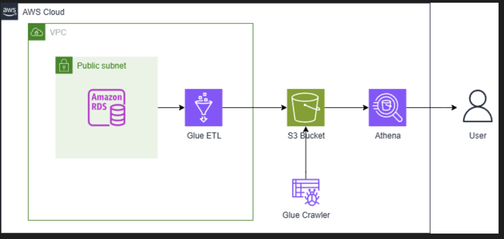

# AWS 

- Amazon RDS: relational databases

- List of AWS CLI commands: https://docs.aws.amazon.com/cli/latest/

- An endpoint is the URL of the entry point for the AWS web service.

## Data pipeline example C1

