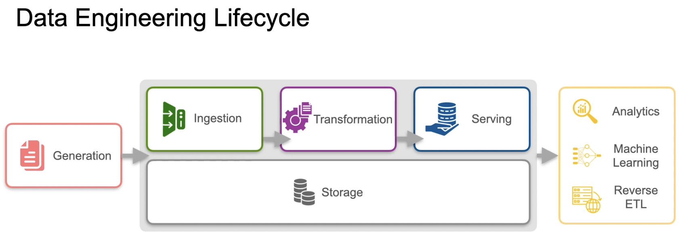
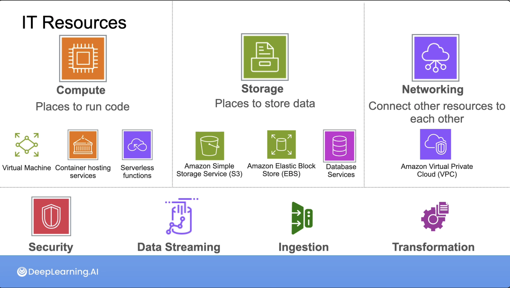

# C1M1 - Introduction

## Data Engineering Lifecycle

## Stakeholders needs 

- Downstream stakeholders: Analysts (*How data we serve generates value for the org?*)
    - How often?
    - What information?
    - How much latency?

- Upstream stakeholders: Software engineers
    - Volume
    - Frequency
    - Format
    - Data Security
    - Regulatory compliance

## Requirements

- Business requirements

- Stakeholder requirements

- System requirements
    - Functional: what the system needs to do
    - Non-functional: how the system accomplishes what it needs to do

- Others:
    - Features and attributes
    - Memory and storage capacity
    - Cost and security constraints

### Requirements gathering

- What solutions are in place?

- What are their pain points?

- Which actions do the stakeholder plan to take with the data?

## Thinking like a Data Engineer

**1. Identify business goals and stakeholders needs**

**2. Define system requirements**
    - Functional requirements 
    - Tech specs

**3. Choose tools & tech**
    - Cost / benefit analysis fit here

**4. Build, evaluate, iterate and evolve**

## Intro to AWS Cloud

- AWS regions do no replicate data from one another. To choose a region, consider:
    - Latency
    - Cost
    - Compliance
    - Service availability

- Availability zone: they are inside a region, separated physically (data copied across zones, so it's always available)

- *Elastic* inside AWS means the systems can scale.

- AWS uses a specific naming convention for the instance types. For example, `t3a.micro`:
    - t: family name
    - 3: generation
    - a: optional capabilities
    - micro: size

### AWS Core Services

- **Compute**
    - Amazon Elastic Compute Cloud (EC2 Instances): VMs
    - AWS Lambda: Serveless code that runs with trigger
    - Kubernet

- **Networks**
    - Amazon Virtual Private Network (VPC): Private network you can create and place resources into; region bound
    - Subnet: a smaller network inside your base network; subnets inside the same VPC can communicate
- **Storage**
    - Object storage: Unstructured data
    - Block storage: Database store, VMs machine file systems and other low-latency envs
    - File storage: Data is organized into files and directories in a hierarchical structure
    - Amazon Relational Database service
    - Amazon Redshit: Data warehouse

- **Security**
    - Follows *shared responsibility model*: Amazon is responsible for security OF the cloud; but you are responsible for how you use it (IN the cloud).
