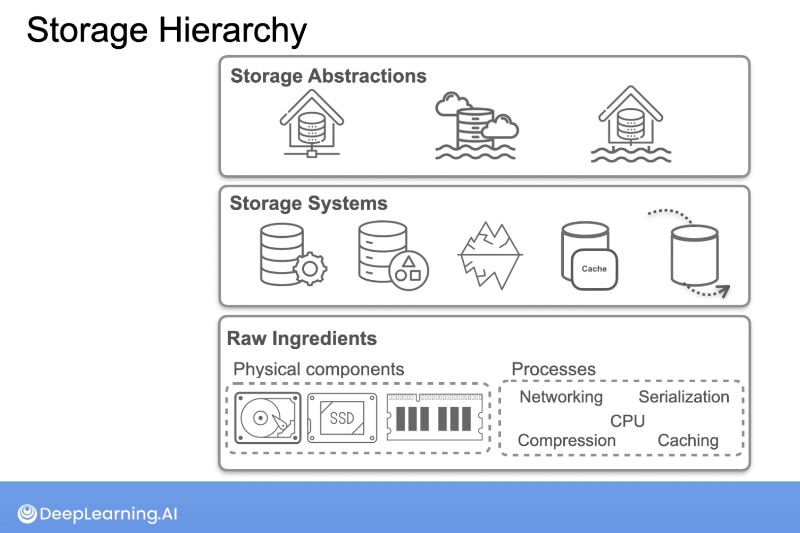

# C1M2 - The Data Engineering Lifecycle and Undercurrents

## Source systems

- Databases (Relational, and NoSQL like key-value and document stores)
- Source systems (files like text, audio and video, but also API)
- Data sharing platforms
- IoT devices

## Ingestion

- Moving raw data from source systems to your pipeline for processing.

- Decision:
    - How frequent/often
    - Batch vs streaming

## Storage

- Types of storage
    - Database management systems
    - Object storage
    - Apache iceberg
    - Memory / cache story
    - Streaming storage

- Storage abstractions
    - Data warehouse
    - Data lake
    - Data lakehouse

- Note: Data engineers usually work on the top level, but understanding what is underneath has impact on latency, availability and cost

## Queries, modeling and transformation

- Query: Issue a request to read records from a database or other storage systems
    - Poor written requires cause raw explosion and lead to bad performance

- Modeling: Represents the way data relates to the real world. The modeling structure needs to make sense to the questions the business has.

- Transformation: Data is manipulated, enhances and saved for downstream used.

## Serving

- Analytics
- Machine Learning
- Reverse ETL

## Intro to Undercurrents