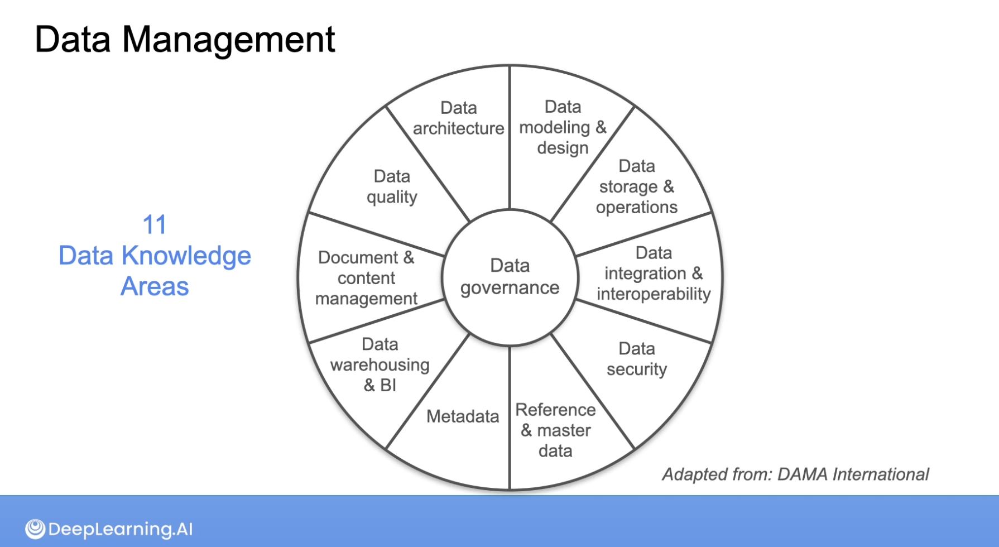

# C1M2 - The Data Engineering Lifecycle and Undercurrents

## Source systems

- Databases (Relational, and NoSQL like key-value and document stores)
- Source systems (files like text, audio and video, but also API)
- Data sharing platforms
- IoT devices

## Ingestion

- Moving raw data from source systems to your pipeline for processing.

- Decision:
    - How frequent/often
    - Batch vs streaming

## Storage

- Types of storage
    - Database management systems
    - Object storage
    - Apache iceberg
    - Memory / cache story
    - Streaming storage

- Storage abstractions
    - Data warehouse
    - Data lake
    - Data lakehouse

- Note: Data engineers usually work on the top level, but understanding what is underneath has impact on latency, availability and cost

## Queries, modelling and transformation

- Query: Issue a request to read records from a database or other storage systems
    - Poor written requires cause raw explosion and lead to bad performance

- Modeling: Represents the way data relates to the real world. The modeling structure needs to make sense to the questions the business has.

- Transformation: Data is manipulated, enhances and saved for downstream used.

## Serving

- Analytics
- Machine Learning
- Reverse ETL

## Undercurrent

A set of practices that fall under the basis of the data engineering lifecycle.
They are covered below:

### Security

- **Principle of Least Privilege**: Only give access to what people really need, and for the duration they need it. This applies to users, but also to the data engineer.

- Do not ingest sensitive data, unless you really need it.

- Apply a **defensive mindset**: Be cautious with sensitive data, and design for potential attacks.

### Data management

- Ensure quality, integrity, security and usability of the data.

- Quality data: Accurate, complete, discoverable, available in timely manner; it is in a format that is exactly what stakeholders expect.

### Data architecture

- Design of systems to support the evolving data needs of an organization, achieved by flexible and reversible decisions reached through a careful evaluation of trade-offs.

- Principles:
    - Choose common components wisely
    - Plan for failure
    - Architect for scalability
    - Architecture is leadership
    - Always be architecting
    - Build loosely coupled systems
    - Make reversible decision
    - Prioritise security

### DataOps

- Improves the development process and quality of data products; it's a set of cultural habits.

- Pillars:
    - Automation: CI/CD
    - Observability & Monitoring
    - Incident response

### Orchestration

- A data pipeline has a lot of moving parts that need to work together to achieve good results.

- DAG: Directed Acyclic Graph
    - Directed: Data flows in one direction
    - Acyclic: Data doesn't flow back
    - Graph: composed of nodes and edges

### Software engineering

- Design, development, deployment and maintenance of software applications.

## Practical examples on AWS

- Amazon DynamoDB: Low latency to large volumes of data (games, iOT), flexible schema