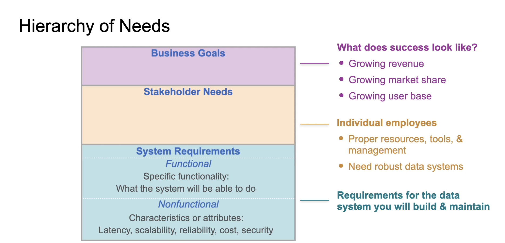

# C1W4 - Translating Requirements to Architecture

- Business goals

- Stakeholder needs

- System requirements (functional vs non-functional)
    - Functional: tasks a pipeline need to perform
    - Non-functional: not things stakeholders explicitly asks for, but needed for the system to work well (ie scalability and latency, reliability, maintainability)

## Main Takeaway

- Identify stakeholders, understand their needs and broader goals of the business

- Ask open-ended questions

- Document your findings

## Iron Triangle

You can only pick two:

- Cost (cheap)
- Scope (good)
- Time (fast)

## When talking to Source System Owners

- Discuss what pain problems or problems there are with existing solutions

- Learn what stakeholders plan to do based on the data you serve them

- Identify any other stakeholders you'll need to talk to if you're still missing information