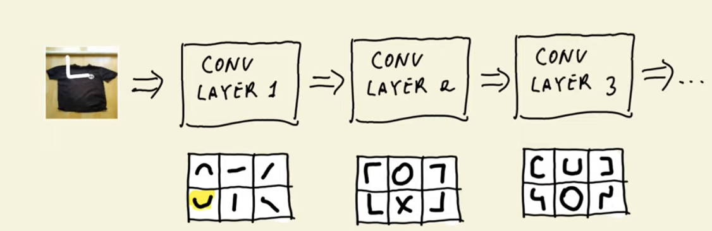

# Neural Networks and Deep Learning

- Deep Learning for Computer Vision | [Stanford Course](https://cs231n.github.io/)


## Tensorflow and Keras - Introduction

- `import tensorflow as tf`: to import tensorflow library
- `from tensorflow import keras`: to import keras
- `from tensorflow.keras.preprocessing.image import load_img`: to import load_img function
- `load_img('path/to/image', targe_size=(150,150))`: to load the image of 150 x 150 size in PIL format
- `np.array(img)`: convert image into a numpy array of 3D shape, where each row of the array represents the value of red, green, and blue color channels of one pixel in the image.

## Pre-trained models

- The keras.applications module has different pre-trained models with different architectures. - We'll use the model Xception which takes the input image size of (229, 229) and each image's pixel is scaled between -1 and 1.
- We create the instance of the pre-trained model using model = Xception(weights='imagenet', input_shape=(299, 229, 3)). Our model will use the weights from pre-trained imagenet and expect the input shape of (229, 229, 3) for images.
- Along with image size, the model also expects the batch_size which is the size of the batches of data (default 32). If one image is passed to the model, then the expected shape of the model should be (1, 229, 229, 3).
- The image data was peprocessed using preprocess_input function during Xception model's pre-taining. Therefore, we'll have to use this function on our data before making predictions, like so: X = preprocess_input(X).
The pred = model.predict(X) function returns 2D array of shape (1, 1000), where 1000 is the probablity of the image classes. decode_predictions(pred) can be used to get the class names and their probabilities in readable format.
In order to make the pre-trained model useful specific to our case, we'll have to do some tweak, which we'll do in the coming sections.
Classes, functions, and methods:

from tensorflow.keras.applications.xception import Xception: import the model from keras applications
from tensorflow.keras.application.xception import preprocess_input: function to perform preprocessing on images
from tensorflow.keras.applications.xception import decode_predictions: extract the predictions class names in the form of tuple of list
model.predict(X): function to make predictions on the test images

## Convolutional Neural Networks

- Convolutions are 'filters'; they are small matrixes that you go "slidding" on the top of your image and look how similar that filter is to that part of your image. 
- Everytime you compare the filter with an image, you het a `feature map`
- You have one feature map for each filter
- A sequency of convulation neural networks learns complex shapes by building on the shapes of the previous layers



- After an image passed through a convolutional network, you have a vector representation of that image

- `Sigmoid` for multiple classes is `softmax`
- `Dense layer` every element of the input is connected to an element of the `output`
- `Pooling` makes a matrix smaller


### Layers in a Convolutional Neural Network
A Convolution neural network has multiple hidden layers that help in extracting information from an image. The four important layers in CNN are:

1. **Convolution layer**
    - This is the first step in the process of extracting valuable features from an image. A convolution layer has several filters that perform the convolution operation. Every image is considered as a matrix of pixel values.
    - Consider a black and white image of 5x5 size whose pixel values are either 0 or 1 and also a filter matrix with a dimension of 3x3. Next, slide the filter matrix over the image and compute the dot product to get the convolved feature matrix.
2. **ReLU layer**
    - Once the feature maps are extracted, the next step is to move them to a ReLU layer. ReLU (Rectified Linear Unit) is an activation function which performs an element-wise operation and sets all the negative pixels to 0. It introduces non-linearity to the network, and the generated output is a rectified feature map. The relu function is: f(x) = max(0,x).
3. **Pooling layer**
    - Pooling is a down-sampling operation that reduces the dimensionality of the feature map. The rectified feature map goes through a pooling layer to generate a pooled feature map.
    - Imagine a rectified feature map of size 4x4 goes through a max pooling filter of 2x2 size with stride of 2. In this case, the resultant pooled feature map will have a pooled feature map of 2x2 size where each value will represent the maximum value of each stride. The pooling layer uses various filters to identify different parts of the image like edges, shapes etc.
4. **Fully connected layer (also called Dense layer)**
    - The next step in the process is called flattening. Flattening is used to convert all the resultant 2D arrays from pooled feature maps into a single linear vector. This flattened vector is then fed as input to the fully connected layer to classify the image.

## Transfer Learning

Transfer learning leverages a pre-trained CNN model, specifically one trained on the large ImageNet dataset, to **reuse its convolutional layers (filters) as generic feature extractors**. 

These convolutional layers have learned to convert images into rich vector representations, which can be reused for new tasks, avoiding the costly process of training from scratch on large datasets. The key idea is to **discard the original dense (fully connected) layers of the pre-trained model**, which are specific to the original dataset’s classes, and **replace them with new dense layers tailored** for the new classification task with fewer classes.

The notebook demonstrates how to:
- load the pre-trained base model (in this case, Xception), 
- exclude its top dense layers, 
- freeze its weights to prevent retraining, and 
- build a new model by 
    - adding global average pooling to transform the multi-dimensional convolutional output into a vector, followed by 
    - a new dense layer for classification.

The training setup involves compiling the model with the Adam optimizer, categorical cross-entropy loss suitable for multi-class classification, and accuracy as the metric. The training process involves multiple epochs iterating over batches of images, with evaluation on a validation set to observe overfitting and performance trends. 


**Highlights**
🔄 Transfer learning utilizes pre-trained CNN convolutional layers as generic feature extractors for new tasks.
🖼️ ImageDataGenerator in Keras efficiently loads and preprocesses image data from directories for training and validation.
🧱 The base pre-trained model (Xception) is loaded without its top dense layers and frozen to prevent retraining.
📊 Global average pooling converts convolutional 3D feature maps into 1D vector representations.
🧠 A new dense classification layer is added on top to predict classes specific to the new dataset.
⚙️ Adam optimizer and categorical cross-entropy loss are used to compile the model for multi-class classification.
📉 Training and validation accuracy curves reveal model fitting trends and the onset of overfitting.

## Callbacks - checkpoints

```python
# wish checkpoints we can save the best model during training
# otherwise the last model is saved, and it might not be the best one

# The checkpoint is created with a callback
checkpoint = keras.callbacks.ModelCheckpoint(
    'xception_v1_{epoch:02d}_{val_accuracy:.3f}.h5',
    save_best_only=True,
    monitor='val_accuracy',
    mode='max' # to maximise
)

history = model.fit(
    train_ds,
    epochs=10,
    validation_data=val_ds,
    callbacks=[checkpoint] # here we pass the checkpoint callback
)
```

## Activation functions
Every layer in the neural network needs an activation function; the activation function is nothing more than the processing of the data.

Some types of activation functions are:

- Sigmoid
- Softmax
- Relu

**NOTE:** When we use `from_logits=True` in the loss function, we don't need to use activation because it implies `activation=softmax` and the processinf is quicker.

## Adding more layers

Adding more layers between the vector and the output can improve the performance of the model.


## Regularisation and dropout
- **Dropout**: During certain iterations we  'freeze' different parts of the network, so the weights do not change. This can help with generalisation.
    - If you're adding dropout you might need to tweak the number of epochs, since you're actively 'removing' part of the net, more epochs might be needed.

## Data augmentation

Data augmentation is essentially creating more data from existing data.
You should look at the dataset, and ask yourself what kinds of variations are there, and how possible transformations could help the training.

You can treat transformations as a hyperparameter. Try with some epochs, if the model is not improving, then drop the transformations. 

Possible transformations:

- Flip it (horizontally and vertically)
- Rotate
- Shift
- Shear

